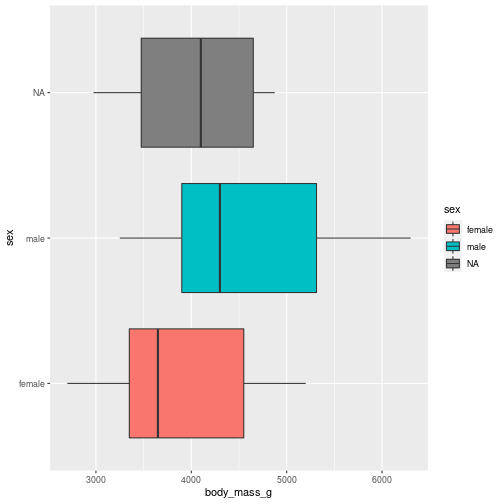
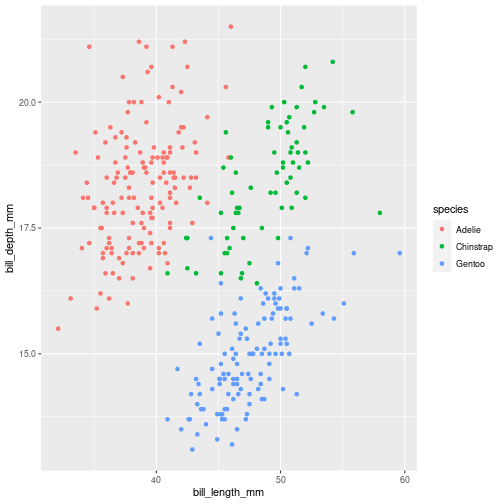

Column {data-width=650}
-----------------------------------------------------------------------

### Scatterplot bill_length_mm  vs  bill_depth_mm,


```r
penguins |> 
        ggplot(aes(body_mass_g, 
                   sex,
                   fill = sex)) + 
        geom_boxplot()
```

```
## Warning: Removed 2 rows containing non-finite values (stat_boxplot).
```



Column {data-width=350}
-----------------------------------------------------------------------

### Chart B


```r
penguins |> 
        ggplot(aes(flipper_length_mm, 
                   fill = species)) + 
        geom_histogram()+
        facet_wrap(~species)
```

```
## `stat_bin()` using `bins = 30`. Pick better value with `binwidth`.
```

```
## Warning: Removed 2 rows containing non-finite values (stat_bin).
```


### Chart C


```r
penguins |> 
        ggplot(aes(bill_length_mm, 
                   bill_depth_mm,
                   color = species)) + 
        geom_point()
```

```
## Warning: Removed 2 rows containing missing values (geom_point).
```



